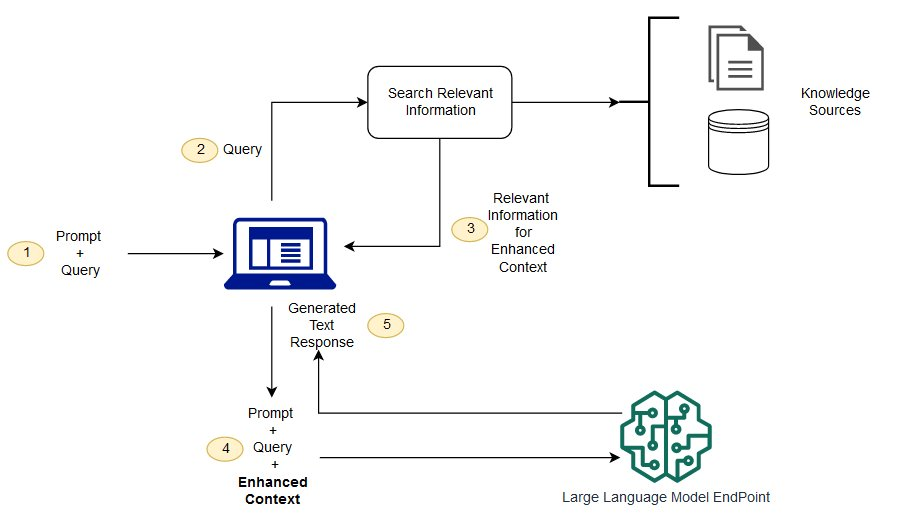

💡 检索增强生成RAG (Retrieval-Augmented Generation) 是一种将信息检索IE (Information Extraction) 与文本生成 (Generation) 相结合的技术，通过信息检索获取外部知识（知识库、网页等），作为提示词工程的一部分输入LLMs，以提升LLMs的输出专业性和准确性。

# 1 为什么我们需要RAG？
回答这一问题需要从必要性和有效性两方面进行
## 1.1 必要性
现有模型在私域数据上泛化性能不强，且自行训练的成本较高、风险较大。
#### a.模型泛化性
- 训练原理：语言模型训练的核心是基于语料集词元（token）之间的条件概率分布对模型参数进行极大似然参数估计，本质上是拟合现有数据条件概率。
- 训练集缺陷：现有模型主要在各领域公开语料上广泛预训练，通用语言建模能力较强，但由于缺少足够的专业化训练数据，在陌生文本上的泛化性能较差。
#### b.训练适配成本
- 语料集成本与风险：现有LLMs的预训练数据在10T量级，若需要对专有领域进行继续训练要求大量的高质量专业数据集，且部分可能存在涉密、隐私问题等。
- 模型训练成本与风险：
	- 预训练：需要对模型全部参数进行调整，只能使用工业化GPU集群，一般的企业和组织无法离线完成。
	- 微调：现有的参数高效微调方式可以让个体使用少量数据对模型部分参数进行轻量级的微调，效果有一定提升但上限明显。
	- 私有化：无法离线预训练意味着需要将专业数据传输到云端，对于私有数据而言存在泄露风险，对于政府、军队等尤为不友好。
	- 时间成本和过程风险：对模型进行全面预训练是复杂的系统工程，时间、资金、人物力可能投入巨大但收效甚微。

## 1.2 有效性
超大语言模型出现涌现能力，可以通过上下文学习（ICL），即基于提示词工程。
  - Zero/Few-shot能力：大参数的语言模型LLMs由于Scaling Law而产生了一定的零样本/少样本学习能力，即仅需要提供输入序列即可基于条件概率生成相关的下文。
  - 输入分布优化：语言模型的这一next token生成范式意味着输入质量在很大程度上决定了输出质量，而输入质量本质上取决于组成输入的token序列在概率分布上是否能够为用户期望的答案提供足够高的条件概率。
  - 提示词工程：为了优化输入序列的概率分布，目前有一系列work的技巧，被统称为提示词工程。例如上下文学习ICL (In Context Learning)、思维链CoT (Chain of Thought)，前者通过提供 输入-输出 示例引导模型输出预期结果，后者通过自然语言表述的推理逻辑引导模型进行推理。提示词工程本质上和人类学习引导逻辑非常相似，可以从一些人际沟通技巧迁移，例如提供相关知识背景、定义，赋予模型任务场景和角色，甚至于恐吓、利诱等等。这是因为在预训练的海量文本中，此类沟通策略广泛存在，并往往导致较好的应答结果，而模型学习到了这种条件概率。一言以蔽之，提示词工程的本质在于使用一些广泛存在于公开文本中的话术策略，引导模型“激活”之前学习到的内容。

综上，由于通用模型在专业领域泛化性能不足，且进行领域适配的模型训练成本高昂风险较大，垂泪领域要想充分利用LLMs的能力必需另辟蹊径，而大模型的提示词工程给出了一条可行的解决路径。检索增强生成RAG就是提示词工程的代表性技术之一，其通过采用传统的信息检索IE技术从专业化知识库中获取相关内容填充LLMs的提示词，低成本引导模型进行专业化应答，并一定程度避免了私有数据外泄的风险。

# 2 RAG系统基础

   

图源https://aws.amazon.com/cn/what-is/retrieval-augmented-generation/

如上，一个Naive的RAG系统主要由三个部分组成
- 用户：RAG不是全自动系统，需要根据用户输入进行工作。
- 检索模块：根据用户输入检索相关信息，通常是 知识库 + 检索器。其中检索器的核心是一个embedding模型以及一套高效索引结构（向量数据库）和相关性指标。
- 生成模块：利用用户输入和检索到的信息进行后续文本生成，通常是语言模型例如LLMs。

因此，一个完整的RAG流程应该是：用户输入问题Query（包含在一个提示词Prompt模板中）——>根据Query从知识库中检索一组topk个相关文本段落Context——>将Context填入Prompt模板并输入LLMs——>获取返回结果。其中输入LLMs的文本数据主要是三种：
- Query：用户输入的问题，例如“李白是谁？”
- Prompt：系统自带或者用户组织的提示词模板，包含一些引导信息和指令内容，用以增强Query信息量，例如“你是一名有用的智能助手，请你......”
- Enhanced Context：从外部知识库中检索到的相关信息，用于进一步增强提示词。

对应的，若希望让LLMs返回匹配用户Query的优质应答，需要在以下三方面进行努力：
- 提问技巧：优化Query，尽可能清晰准确地表述问题，并描述你对返回内容的期望。
- 提示词：优化Prompt，尽可能采用一些通用或有效的信息组织策略，补充Query的沟通语境和技巧，并规定输出格式。
- 信息检索：优化检索到的Enhanced Context，一方面需要组织优质的知识库，另一方面需要提高检索器的性能（如准确性），使得根据Query查询到的一组返回是高度相关且有益的。

# 3 RAG系统增强
基于Naive的RAG架构，可以对两个基本组件（检索器和生成器）进行非常多方面的优化，这些优化可以进一步提升效果，这里做一个相对全面的总览。

## 3.1 检索器优化

RAG检索器的优化需从输入增强、模型架构、混合召回、后处理、系统设计五个层面综合考虑：
- 轻量场景：优先BM25+元数据过滤，搭配缓存机制。
- 高精度需求：使用对比学习训练的Dense Retrieval（如DPR）+ Cross-Encoder重排序。
- 多模态数据：CLIP跨模态对齐+图结构召回。
- 动态环境：增量索引+在线学习，持续适配数据分布变化。

最终需通过A/B测试验证策略有效性，平衡检索质量与系统开销。

### 3.1.1 检索输入优化
Query Rewriting重写用户Query，包括纠正、扩展、分类等方面
  - 纠正：对内容表述中的错误、模糊进行纠正
  - 扩展：
    - 实体识别与扩展：实体是Query的核心要素，补充实体别名、上位词或相关属性。例：用户输入“苹果发布会” → 扩展为“Apple Inc.发布会（iPhone 15 Pro, iOS 17）”。
    - 同义词与上下文扩展，例如对一些生僻的术语进行解释、对可能涉及的方向生成一组类似的Query等
  - 意图分类：基于分类模型判断Query意图（事实型、建议型、比较型），动态调整检索策略。

### 3.1.2 检索器模型架构
  - 针对性训练：对词嵌入embedding模型在专业领域数据集上调优
    - 独立训练：在专业语料库上优化语言建模，具体有对比学习、蒸馏，或直接采用专业领域预训练模型。
    - 贯序训练：先训练检索器或生成器模型，再在此基础上训练另外一个。
    - 联合训练：与生成器模型一起训练，在不同损失函数权衡中优化性能，使得检索效果与生成模型在概率分布上更加适配。
  - 编码架构优化：
    - 双塔模型（Dual Encoder）：独立编码Query和文档
    - 交叉编码器（Cross-Encoder）：联合编码Query-Doc对
    - 多粒度编码：混合词级、句级、段级嵌入（如Poly-Encoder），捕捉不同粒度语义。

### 3.1.3 混合召回
即Hybrid Retrieval混合检索和多模态检索，使用不同的相关性模型并行检索，行多路召回，兼顾各种相关性
- Sparse稀疏检索：最常用的TF-IDF和BM25模型。
- Dense稠密检索：词向量模型，例如BERT。
- Rule-based检索：例如采用正则匹配、关键字匹配等方式。
- Graph检索：根据Query从知识图谱中获取相关信息，例：检索“量子计算”时，关联知识图谱中“量子比特”“超导电路”等技术节点。
- 其他结构化数据检索：例如结合SQL从表格中检索相关结构化信息。
- 多模态Multimodal：通过对编码器的跨模态对齐，不仅可以检索文本，还可以检索图片等其他模态，丰富可用知识库数据来源。

对于不同的检索源，需要采取一些召回机制进一步优化，如

- 时间敏感召回：对时效性强的Query（如新闻、股票），优先检索近期文档，并动态更新索引。
- 元数据过滤（Metadata Filtering）：结合文档的发布时间、作者权威性、来源可信度等元数据筛选候选集

### 3.1.4 后处理
- 重排序Rerank：对召回的一组文档内容根据与Query的相关性进行排序与删减。
- 置信度Confidence：对召回文档的置信度打分进行温度缩放（Temperature Scaling），避免高置信度错误
- 多样性控制：平衡相关性与多样性，避免冗余结果。例：检索“新能源汽车”时，同时包含技术参数、政策解读、市场分析。

### 3.1.5 系统级优化
- 索引结构动态更新：支持实时添加新文档，减少全量重建开销
- 缓存机制：加速
- 负采样策略：从实际场景中收集困难负样本（如相似但不相关文档），提升模型鲁棒性。

## 3.2 生成器优化
生成器通常采用LLMs，因此针对生成器的优化策略受资源等条件限制相对有限，主要分为训练端优化和生成端优化。

### 3.2.1 训练端
- 基座模型训练优化（不考虑）：
  - 优化模型架构设计：如Transformer架构、训练策略（损失函数）
  - 预训练数据质量优化
  - 联合训练：与生成器模型联合训练，共享梯度更新，使用混合的损失函数，如检索损失（如负对数似然）和生成损失（如交叉熵）
- 轻量级训练优化（看条件）
  - 量化、蒸馏、剪枝等
  - **指令微调**：在垂直领域有监督数据（如医学、法律）上微调生成器，适配专业术语与逻辑，使用LoRA等轻量化参数高效方案。
  - **对齐微调**：使用强化学习RLHF（如PPO）和偏好优化（如DPO）进行对比学习。

### 3.2.2 生成端
- 风格与格式控制：
  - **提示工程**（Prompt Engineering）：在输入中添加结构化指令（如“用简洁的列表回答”“避免专业术语”），引导生成风格
  - **答案模板定义**：预定义答案模板（如问题-原因-解决方案），生成器填充具体内容，确保逻辑结构。
- 减少幻觉（Hallucination）
  - **检索结果约束**：强制生成器仅基于检索到的文档生成答案，使用受限解码（如Constrained Beam Search）
  - 可验证性增强：在生成答案时标注引用来源（如“根据文档A第3段…”），提升可信度（如Meta的Atlas模型）。
  - 后验验证：用小型判别模型检查生成内容与检索文档的一致性（如DeHallucinator）。