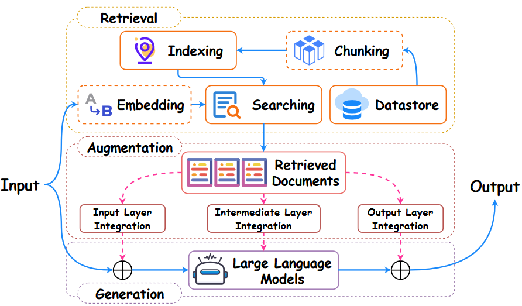

<!-- JPW的Markdown笔记模板 v1, 其中的href需要视情更改上级目录href="../../format.css -->
<link rel="stylesheet" type="text/css" href="../../format.css">

<h1>RAG系列：RAG综述</h1>

💡 [A Survey on RAG Meeting LLMs: Towards Retrieval-Augmented Large Language Models](https://dl.acm.org/doi/abs/10.1145/3637528.3671470), KDD 2024。数据库/数据挖掘/内容检索 CCF A会。

# 0 Abstract
作为人工智能中最先进的技术之一，检索增强生成（RAG）可以提供可靠和最新的外部知识，为众多任务提供极大的便利。特别是在人工智能生成内容（AIGC）时代，提供额外知识的强大检索能力使RAG能够协助现有的生成式人工智能生成高质量的输出。最近，大型语言模型（LLMs）在语言理解和生成方面表现出了革命性的能力，但仍然面临着固有的局限性，如幻觉和过时的内部知识。鉴于RAG在提供最新和有用的辅助信息方面的强大能力，检索增强大型语言模型（RA-LLM）已经出现，以利用外部和权威知识库，而不是仅仅依赖模型的内部知识，来提高LLM生成内容的质量。在这项调查中，我们全面回顾了RA-LLM的现有研究，涵盖了三个主要的技术角度：架构、训练策略和应用。此外，为了提供更深入的见解，我们讨论了当前的局限性和未来研究的几个有前景的方向。有关此调查的最新信息，请访问https: // advanced-recommender-systems.github.io/ RAG-Meets-LLMs/

# 1 INTRODUCTION

检索技术retrieval旨在理解输入query并从外部数据源中提取相关信息，在搜索、推荐和问答系统中应用广泛，作用如下：
- 过滤和检索与用户查询相匹配的最相关的网页或文档，使用户能够有效地找到所需的信息。
- 提供忠实及时的外部知识，从而在各种知识密集型任务中发挥重要作用。

由于其强大的能力，在人工智能生成内容（AIGC）时代，检索技术被进一步探索，尤其是检索模型与语言模型的集成产生了检索增强生成（RAG），旨在**利用检索到的信息提高生成的文本内容的质量**。

一般来说，RAG首先调用检索器在外部数据库中搜索和提取相关文档。然后将这些文档与原始查询结合作为上下文context，以增强答案生成过程。在实践中，RAG技术是可行且有效的，可以应用于各种生成任务，只需调整检索组件，只需很少甚至不需要额外的训练[98]。最近的研究表明，RAG在知识密集型任务（如开放域问答（OpenQA）和一般语言任务与下游应用程序方面也具有巨大潜力。

尽管LLMs功能强大，LLM仍然存在固有的局限性：
- 通用模型缺乏专业领域知识：
- 幻觉问题：在医学和法律等特定领域尤为突出。例如，最近的一项研究表明，法律幻觉是普遍存在的，令人不安的，最先进的LLMs在回答具体法律问题时，幻觉率从69%到88%不等。
- 更新LLM所需的大量计算资源。

为了解决这些局限性，RAG被用于提高LLM在对最新和可靠的知识要求很高的任务中的能力，如问答（QA）、AI4Science和软件工程。借助RAG从外部数据库中检索相关知识并将其整合到生成过程中，对话系统成功地给出了正确的答案。鉴于RAG在推进LLM方面取得的显著进展，迫切需要对检索增强大型语言模型（RA LLM）的最新进展进行系统回顾。

本调查通过分别从架构、训练策略和应用领域总结代表性方法，全面概述了RA-LLM。
- 第2节中，它首先从三个主要角度回顾了现有RA-LLM的架构：检索、生成和增强。
- 第3节进一步总结了培训技巧。
- 第4节介绍了各种RA-LLM应用程序。
- 第5节进一步讨论了未来勘探的主要挑战和潜在方向。

# 2 RA-LLMS
RETRIEVAL-AUGMENTED LARGE LANGUAGE MODELS检索增强的LLMs。LLM时代的RAG框架由几个主要过程组成：检索、生成和增强。在本节中，我们将介绍每个过程中涉及的重要技术。
## 2.1 检索Retrieval
给定来自LLM输入的查询，检索器是RAG中的信息提供者，旨在通过测量**查询与文档之间的距离**来从外部知识库返回相关知识。如上图所示，检索组件由几个强制或可选的过程组成。检索部分的具体管道由几个设计角度共同决定，如检索器类型和检索粒度。在本小节中，我们将基于这些关键方面介绍RA LLM中现有的检索方法。

### 2.1.1 Retriever Type：稠密和稀疏
基于信息编码方法，检索方法一般可分为稀疏和密集两类。稀疏检索是基于单词的，主要应用于文本检索，而密集检索将查询和外部知识嵌入向量空间，可以应用于各种数据格式。

#### 2.1.1.1 稀疏检索Sparse retrieval
例如TF-IDF和BM25，通常依赖于倒排索引（inverted index）匹配以及原始数据输入。例如，许多研究直接将BM25应用于段落级passage-level检索，其中段落被具体表示为一袋单词，并根据 **词频TF (term frequency)** 和 **逆文档频率IDF (inverse document frequencies)** 进行排名。除了提供补充以增强生成器的输入外，稀疏检索还被用于在RA-LLMs的上下文学习（ICL）中查找样例演示（few-shot示例输入输出对）。在RAG中应用稀疏检索的主要局限性是它没有训练性质，这使得检索性能在很大程度上依赖于数据库和查询的质量。此外，这种基于固定术语的方法只支持基于相似性的检索，而不能适用于LLM应用程序中可能存在的其他检索标准，如多样性。

#### 2.1.1.2 稠密检索Dense retrieval
相反，密集检索将查询和文档嵌入到具有特定条件的连续向量空间中，例如语义相似性。密集检索方法通常是可训练的，因此在适应方面具有更大的灵活性和潜力。作为密集检索器的关键组件，embedding嵌入模型在现有的RAG模型中具有微妙的不同设计：
- 直接使用生成模型的embedding层：这可能能够增强检索和生成过程之间的对齐。
- 使用基于BERT的神经网络：

常见的检索器设计有两种结构：
- 双编码器：两个具有BERT结构的流编码器（一个用于查询query编码，另一个用于文档document编码）。早期RAG方法倾向于冻结或部分冻结检索器的参数，并更加注重知识利用和生成器微调。大规模预训练进一步增强了RAG模型。一个典型的成功是密集段落检索器DPR（Dense Passage Retriever），它使用基于BERT的骨干网，并经过专门针对OpenQA任务的预训练，使用问答对数据。最近的一项研究还发现，DPR训练分散了知识在网络中的存储方式，为同一信息创建了多条访问路径。通过有效的微调，双编码器检索器也广泛应用于基于ICL的RAG。具体来说，我们更常使用基于相似度的句子嵌入sentence embedding检索，以及ICL中的一些特殊要求，如多样化的示例检索。

- 单编码器：基于Transformer、BERT或其他现成的序列建模骨干网。这些单编码器检索器通常通过**对比学习**在大规模未对齐的文档上进行预训练，因此可能因其多功能性而表现出色，这意味着它们可以更好地转移和推广到新的领域或任务。这种通用的预训练检索器，将更灵活地用于针对各种任务的LLM，并已在许多RA-LLM方法中证明了其有效性，如in-Context RALM、Atlas和Self-RAG。

### 2.1.2 Retriever Granularity：检索粒度

检索粒度表示对语料库进行索引的检索单元，例如文档document、段落passage、token或实体entity等其他级别。对于RAG，检索粒度的选择会显著影响模型在有效性和效率方面的整体性能，因为它们决定了数据库的节省空间以及搜索的计算成本。
- Document检索：早期采用，然后应用经过训练的机器理解模型来检测返回文档中的答案跨度，该模型更侧重于语言阅读和文档中的关键信息定位。
- Chunk检索：在某些参考文献中也称为段落passage，它已被用于传统和基于LLM的RAG模型。文本块chunk包含紧凑完整的信息，冗余和无关性较小，是目前的主流。
- Token检索，可以通过更快的搜索完成，但会给数据库保存带来更多负担。token检索更适合于需要罕见模式或域外数据的情况。
- Entity检索：实体检索，从知识而不是语言的角度设计的。Févry等人引入了实体即专家（EAE）模型，该模型根据实体身份划分语言模型的参数空间。所提出的EAE模型旨在通过维基百科数据库从文本中学习实体表示以及其他模型参数，并用实体记忆表示知识。在更细粒度的层面上，de Jong等人提出通过学习和检索提及而不是实体来构建知识库。总体而言，在RAG中应用实体或提及级检索对于以实体为中心的任务更有效，与令牌检索相比，在空间上更有效。

## 2.2 生成Generation
生成器的设计在很大程度上取决于下游任务。对于大多数文本生成任务，Decoder-only 和 Encoder-Decoder是两种主要模型结构。商业闭源大型基础模型的最新发展使黑盒black-box生成模型成为RA-LLM的主流。在这一部分中，我们将简要回顾这两种生成器的研究：参数可访问（白盒）和参数不可访问（黑盒）。

### 2.2.1 参数可访问生成器：开源模型
Encoder-Decoder的结构使用不同的模块独立处理输入和目标，其中开发了一个交叉注意力组件，将输入token连接到目标token。代表性的Encoder-Decoder包括T5和BART。这两种类型的生成器在现有的RAG工作。相比之下，Decoder-only模型仅对级联后的输入和目标进行建模。现有的RAG中有使用BART、T5以及其他的定制化设计的Encoder-Decoder架构。白盒生成器允许参数优化，可以对其进行训练以适应不同的检索和增强方法，从而获得更好的生成性能。

### 2.2.2 参数不可访问的生成器：闭源模型
如GPT系列、Codex和Claude等闭源LLMs被称为黑盒生成模型。这些生成器只允许馈送查询（输入）和接收响应（输出）的操作，而不允许更改内部结构或更新参数。从另一个角度来看，LLM，即使是那些开放进行微调的LLM，规模也很大，很难针对数据量有限的下游领域特定任务进行调优。因此，黑盒RA-LLM更侧重于检索和增强过程，试图通过为生成提供更好的知识、指导或示例来增强输入（在LLM的上下文中也称为提示prompt），从而增强生成器。

## 2.3 增强Augmentation

   

Retrieval Integration for Generation Augmentation用于生成增强的检索集成。增强描述了集成检索和生成部分的技术过程，这是RA-LLM的重要组成部分。在本小节中，我们介绍了三种主要的增强设计，分别在生成器的输入层、输出层和中间层进行，如上图所示。

### 2.3.1 Input-Layer Integration
将检索到的信息/文档与原始输入/查询相结合，并将它们共同传递给生成器，这称为输入层集成。尽管有效，但这种集成仅限于检索到的文档数量，因为连接的新输入可能太长，无法由生成模型处理。一般来说，大多数基于黑盒生成的RAG方法都应用了输入层集成，因为生成模型的中间层或输出分布都不可访问。更具体地说，对于LLM，输入层集成可以将检索到的内容用作（额外的）提示prompt，而不是像传统RAG那样将其用作原始输入的补充。但是这种方式会占用输入窗口长度。

### 2.3.2 Output-Layer Integration
另一种增强是输出层集成，它将检索和生成结果的token概率分布结合起来进行预测。例如，kNN LM在预测中综合使用两个next token的概率分布：一个由语言模型自身产生，另一个由检索语料库中的KNN产生。输出层线性集成应用灵活，因为它可以插入大多数生成模型，而无需额外的训练。然而，输出层集成的简单性也限制了模型对检索到的文本进行推理的能力。

### 2.3.3 Intermediate-Layer Integration
与上述两种非参数方法相比，一种更具吸引力的增强方法是设计一个半参数模块，在LM语言模型中增加一个层，这被称为中间层整合。这种集成可能会增加额外的复杂性，并有望通过有效的训练来增强生成模型的能力。通常，引入一个Transformer模块来利用检索到的信息（主要编码为密集表示）进入生成模型，以在生成的中间阶段与表示进行交互。

# 3 RA-LLMS TRAINING
根据是否需要训练，现有的RAG方法可分为两大类
- 无需训练
    - 提示词工程
    - 检索器token分布校准LM token分布
- 需要训练：
    - 独立训练方法：RAG程序中的每个组件，
    - 顺序训练方法：首先训练一个模块，并冻结权重以指导另一部分的调整过程，
    - 联合训练方法：同时训练检索器和生成器。
## 3.1 Training-free
无训练方法通常在推理时直接利用检索到的知识，这在计算上是高效的。然而，检索器和生成器组件没有针对下游任务进行专门优化，这很容易导致检索到的知识利用率不理想。根据大型语言模型利用检索信息的不同方式，我们将这些无训练方法分为两类：

### 3.1.1 提示词工程
Prompt Engineering-based Methods，将检索到的知识直接集成到原始提示中。具体来说，检索到的文本通常被用作上下文信息，并与原始提示相结合，以指导生成大型语言模型。例如，ICL文本内学习和CoT思维链方法。

### 3.1.2 检索引导的token生成方法
Retrieval-Guided Token Generation Methods检索信息以校准token生成过程。KNN KMs首先根据给定的查询从数据存储中检索最相关的上下文，并根据距离计算邻居分布。通过组合KNN分布和原始模型的输出分布来校准输出token分布。

## 3.2 Training
### 3.2.1 独立训练
将检索器和大型语言模型（LLM）训练为两个完全独立的过程，在训练过程中检索器和LLM之间没有交互。对于大型语言模型的训练，负对数似然损失是最具代表性的训练目标，旨在指导大型语言模型根据给定的输入生成所需的输出。关于检索器，它可以分为两种类型：
- 稀疏检索器：利用稀疏特征（如词频）来表示文档，并根据任务特定的度量（如TF-IDF和BM25）计算相关性得分。
- 密集检索器。采用深度神经网络将查询和文档编码为密集表示，然后通常使用内积来计算相关性得分并检索相关的外部知识。

### 3.2.2 顺序训练
为了更好地增强检索器和生成器之间的协同作用，已经提出了几种方法来顺序训练检索器和大型语言模型。在这些顺序训练方法中，该过程通常从检索器或生成器的独立预训练开始，之后固定预训练模块，而另一个模块进行训练。与独立训练相比，序贯训练涉及检索器和生成器的协调训练。根据不同的训练顺序，顺序训练可分为两类：
#### 3.2.2.1 检索器优先
这些方法首先训练检索模型，冻结参数。然后利用检索到的知识训练大型语言模型。

#### 3.2.2.2 LLMs优先
同样，我们也可以先对LLMs进行预训练，然后在训练有素的LLM的监督下对检索器进行调优。例如，DKRR表明，序列到序列模型的注意力得分可以指示文档的相关性。因此，他们建议利用LLMs模型的注意力得分来生成合成标签来训练检索器。

### 3.2.3 联合训练
采用端到端范式同时优化检索器和生成器。联合训练方法没有按顺序训练每个模块，而是有效地提高了检索者定位外部知识以生成的能力，以及生成器有效利用检索到的信息的能力。例如，RAG最小化了联合训练检索器和生成器的负对数可能性。REALM[44]采用与RAG[66]类似的训练范式，并使用最大内积搜索（MIPS）技术来定位最相关的文档。为了使用MIPS，首先嵌入所有外部文档，并为每个嵌入生成搜索索引。

## 4 应用
在本节中，我们将介绍检索增强大型语言模型（RA-LLMs）的一些代表性应用。为了清晰地概述RA LLM的应用，我们将从三个角度对其进行回顾：NLP应用、下游任务和特定领域的应用。
### 4.1 NLP应用
由于文本生成的内在能力，RA LLM在NLP领域有各种应用，如问答（QA）系统、聊天机器人和事实验证（Fact Verification）。

### 4.2 下游任务
RA LLM还可以应用于各种下游任务，如推荐和软件工程

### 4.3 特定领域的应用程序
RA LLM已被广泛应用于各种特定领域的任务，如科学和金融领域的人工智能。前者，RA-LLMs已被证明对分子和蛋白质等科学领域有益，且可以服务于形式化证明等工作。对于后者在高度数据驱动和信息密集型的金融领域，RA-LLM已被证明是增强决策的重要技术。例如，Zhang等人从新闻平台（如彭博社和路透社）和社交媒体平台（如推特、Reddit）等外部来源检索财务信息，与原始查询相结合，以提高财务情绪分析的准确性。此外，财务质量保证是财务分析的另一项主要任务，其通常从财务文档中提取相关知识。由于专业文档通常以PDF格式存储，林介绍了一种结合RA LLM的PDF解析器，用于从财务报告中检索知识。另一方面，Yepes等人提出了一种基于结构的文档分块方法，而不是基于段落的分块，进一步提高了RA-LLM输出的质量。